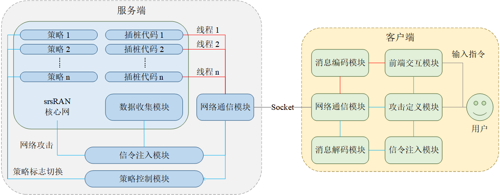

# LSCAP
> 在 LTE 的安全研究中，开源 Software-Definition Radio（SDR）常被用于攻击验证。然而，由于 LTE 协议以及 SDR 代码的复杂性，理解并修改其代码将会耗费大量的时间，并且要求研究者具有较高的编程水平。因此，为了提高 LTE 安全研究的效率，我们设计并开发了一款基于 srsRAN 的 LTE 网络安全研究平台 — LSCAP。

LSCAP（LTE Signaling Control and Analyse Platform）是一款基于 srsRAN 的 LTE 网络安全研究平台。

## 概述

LSCAP 基于开源 LTE 协议栈 srsRAN 搭建，由服务端和客户端两部分组成。

LSCAP 的架构如下图所示：

> 其中，服务端模块使用蓝色标记，客户端模块使用绿色标记，下行数据流使用红色箭头标记，上行数据流使用蓝色箭头标记。

### 服务端

LSCAP 的服务端使用 C++ 语言进行编写，可以实现跟踪并操控 srsRAN 的协议流程、拦截 srsRAN 中的消息并发送到客户端、接收客户端的指令并向网络发起攻击、收集网络中的安全数据以及控制 srsRAN 中函数的执行策略等功能。服务端与 srsRAN 的 EPC 绑定在一起，服务端的代码将与 srsepc 的代码一起进行编译和运行。当 srsRAN 初始化 srsepc 时，会创建一个新的线程来初始化本平台的服务端，并使服务端与本平台的客户端之间建立起 socket 连接，这样用户就可以通过客户端与 srsRAN 进行交互。

LSCAP 的服务端包括的模块如下：

- 代码插桩模块：能够拦截 srsRAN 中的消息并创建线程与客户端进行通信
- 网络通信模块：能够完成数据的收发
- 安全数据收集模块：能够收集 srsRAN 中的安全数据
- 信令注入模块：能够根据用户指令向网络中注入伪造的非法信令
- 策略控制模块：能够根据用户指令控制网络的消息处理策略

### 客户端

客户端使用 Python 语言进行编写，可以实现接收并解析来自服务端的消息、对发送和接收的消息进行编解码处理、实时读取用户输入的指令并发送到服务端以及模拟恶意攻击者向网络注入伪造的非法信令等功能。本平台的客户端由一些 Python 模块和编解码共享库组成，其代码与平台服务端的代码充分解耦，可以独立进行部署。

LSCAP 的客户端包括的模块如下：

- 网络通信模块：能够完成数据的收发
- 消息编解码模块：能够对消息进行编解码处理
- 前端交互模块：能够实时地读取并处理用户的输入
- 攻击定义模块：能够让用户灵活地定义攻击的流程
- 信令注入模块：能够根据攻击的定义命令服务端向网络注入伪造的非法信令

## 特点

### 扩展性

LSCAP 为 srsRAN 提供了更加丰富的执行策略，并使用服务端进行控制。该设计可以将 srsRAN 中不同研究之间的代码进行隔离，并封装为不同的策略，从而使我们能够轻易地对更多的研究内容进行扩展。

具体地，不同的策略之间使用一个 flag 变量进行区分，当服务端收到来自客户端的指令时，会根据用户指令为对应的 flag 进行设置，然后 srsRAN 的函数就会根据 flag 自动切换不同的处理策略。比如，当验证鉴权同步失败攻击时，为了更好地观察攻击的结果，我们需要修改 HSS 中关于 SQN 的算法，加速攻击生效的过程。然而，当我们想验证其它攻击时，还需要恢复 HSS 中的代码，并对 srsRAN 的代码重新进行编译和运行，该过程会耗费大量的时间。当使用 LSCAP 来验证该攻击时，我们可以将 HSS 中不同的算法封装为不同的策略，并根据用户指令进行切换，这样就可以减少用户大量的重复工作，并且可以根据需要增加更多的策略，具有很好的可扩展性。

### 灵活性

LSCAP 将客户端中不同攻击的定义封装为了不同的指令，每一个指令都对应一个用户定义的攻击流程，并且还提供了与用户进行交互的接口。该设计使用户可以根据当前网络的执行情况，实时地向服务端发送指令，用户只需要输入当前希望执行的指令，然后客户端就会读取该输入并执行不同的攻击，具有很好的灵活性。

### 并发性

LSCAP 采用了多线程技术，可以更好地支持对并发类型的攻击进行验证。当 srsRAN 执行到插桩代码处时，LSCAP 会使用 `pthread_create()` 函数创建一个新线程与客户端进行通信，因此我们可以同时在网络的多个位置处注入信令，这使用户能够对攻击模式更加复杂的攻击进行验证。

LSCAP 还可以选择使用 `pthread_join()` 函数阻塞当前的协议流程，该设计可以保证服务端成功接收并执行完用户指令后，协议栈才继续向下执行，避免了用户指令还未生效而协议栈就提前进入了下一个流程从而使攻击验证失败的情况。比如，当验证麻木攻击时，如果没有阻塞后续的鉴权流程，那么协议原本的 `authentication_request` 消息可能先于 `authentication_reject` 消息被发送，从而使攻击验证失败。

### 数据收集

LSCAP 提供了对安全数据进行收集的能力，可以在 srsRAN 运行的过程中收集网络中的安全数据。比如，LSCAP 会动态地收集并更新 UE 上下文、基站 socket 信息、EPC 接口信息等数据，这些数据可以被服务端用于组装和发送伪造的信令。另外，这些数据也可以根据用户需求被提取出来，提供给有需要的团队进行相关的研究和分析。

## 部署

> LSCAP 的部署详见：LSCAP\docs\环境搭建教程

## 使用

### 工作流程

1. 终端向核心网发送消息
2. 服务端的插桩代码拦截该消息，然后创建线程循环接收来自客户端的 LSCAPcmd，同时将当前拦截到的消息类型和插桩信息等内容组装为 LSCAPmsg 并发送给客户端，最后阻塞接下来的协议流程
3. 客户端接收并解析来自服务端的 LSCAPmsg，然后向用户给出关于 LTE 协议栈当前执行情况的提示，等待并读取用户的输入
4. 客户端根据用户输入的指令调用对应的攻击函数
5. 客户端向服务端组装并发送攻击对应的 LSCAPcmd
6. 服务端根据接收到的 LSCAPcmd 对 LTE 网络发起对应的攻击
7. 用户向客户端输入 `exit_loop` 指令
8. 客户端向服务端组装并发送 `exit_loop` 指令对应的 LSCAPcmd，通知服务端结束当前插桩代码处的循环接收，并继续协议原流程

> 本平台客户端中的攻击流程需要用户自己编写代码进行定义。为了降低平台对研究人员编程水平的要求，本平台采用了以简洁性著称的 Python 语言作为平台客户端的开发语言，并且基于 ctypes 库在 Python 中重新定义了协议栈中的消息 ID 和结构体。基于重写的消息 ID 和结构体定义，用户不仅可以在客户端中将套接字字节流解析为消息名称和结构体，还可以通过名称索引消息结构体成员并进行高级的逻辑操作。

### LSCAPmsg

LSCAPmsg 是服务端向客户端发送的消息，具有固定的格式。当客户端收到来自服务端的 LSCAPmsg 时，可以根据平台规定的消息格式对消息内容进行解析并提取其中各字段的值。

LSCAPmsg 各字段的定义如下所示：

|    字段    |  类型   |                        说明                        |
| :--------: | :-----: | :------------------------------------------------: |
| message_id | uint8_t |   表示平台定义的消息 ID，对应 LTE 协议栈中的信令   |
|   ue_id    | uint8_t |        表示平台当前拦截的消息属于哪一个 UE         |
|   length   | uint8_t |               表示当前发送的消息长度               |
|  message   |  char*  | 用于存储消息的全部内容，其内存根据消息长度动态分配 |

LSCAPmsg 的类型如下所示：

|         类型          |          说明          |
| :-------------------: | :--------------------: |
| LEAP_INITIAL_NAS_DATA | UE 初始附着的 NAS 消息 |
| LEAP_EMM_SECURITY_CTX |    UE 的安全上下文     |
|   LEAP_AUTH_FAILURE   |      UE 鉴权失败       |
| LEAP_ATTACH_COMPLETE  |      UE 完成附着       |
|   LEAP_TAU_REQUEST    |  UE 请求进行位置更新   |

### LSCAPcmd

当服务端收到来自客户端的 LSCAPcmd 时，可以根据规定的格式对 LSCAPcmd 进行解析并获取其中各字段的内容。

LSCAPcmd 各字段的定义如下所示：

|    字段    |  类型   |                      说明                      |
| :--------: | :-----: | :--------------------------------------------: |
| command_id | uint8_t |             平台内部定义的指令 ID              |
|   ue_id    | uint8_t |      表示平台当前拦截的消息属于哪一个 UE       |
|   cause    | uint8_t |   用于为某些特定的消息指定其 emm_cause 字段    |
|   length   | uint8_t |             表示当前发送的消息长度             |
|  message   |  char*  | 用于存储消息的内容，其内存根据消息长度动态分配 |

LSCAPcmd 的类型如下所示：

|                 类型                  |                          说明                          |
| :-----------------------------------: | :----------------------------------------------------: |
|               EXIT_LOOP               |              退出当前插桩代码处的循环接收              |
|             IMSI_CATCHING             |             抓取受害 UE 的 IMSI 并进行打印             |
|      SET_AND_SEND_ATTACH_REJECT       |         向受害 UE 发送一条 attach_reject 消息          |
|  SET_AND_SEND_AUTHENTICATION_REJECT   |     向受害 UE 发送一条 authentication_reject 消息      |
| SEND_NETWORK_INITIATED_DETACH_REQUEST |         向受害 UE 发送一条 detach_request 消息         |
|       AUTH_SYNC_FAILURE_ATTACK        |            向 LTE 网络发起鉴权同步失败攻击             |
|      STEALTHY_KICKING_OFF_ATTACK      | 向受害 UE 发送一条以 IMSI 作为 ue_paging_id 的寻呼消息 |
|        SET_AND_SEND_TAU_REJECT        |           向受害 UE 发送一条 tau_reject 消息           |
|     SET_AND_SEND_IDENTITY_REQUEST     |        向受害 UE 发送一条 identity_request 消息        |

## 成果

> 本研究的成果详见：LSCAP/docs/实验结果记录

## 笔记

> srsRAN 的学习笔记详见：LSCAP/docs/srsRAN代码分析

## 论文

本研究的成果在 2023 4th Information Communication Technologies Conference (ICTC 2023) 上进行了发表。

论文题目为：《A Platform Based on srsRAN for Security Research in LTE Network》

> 论文的内容详见：LSCAP/docs/论文

